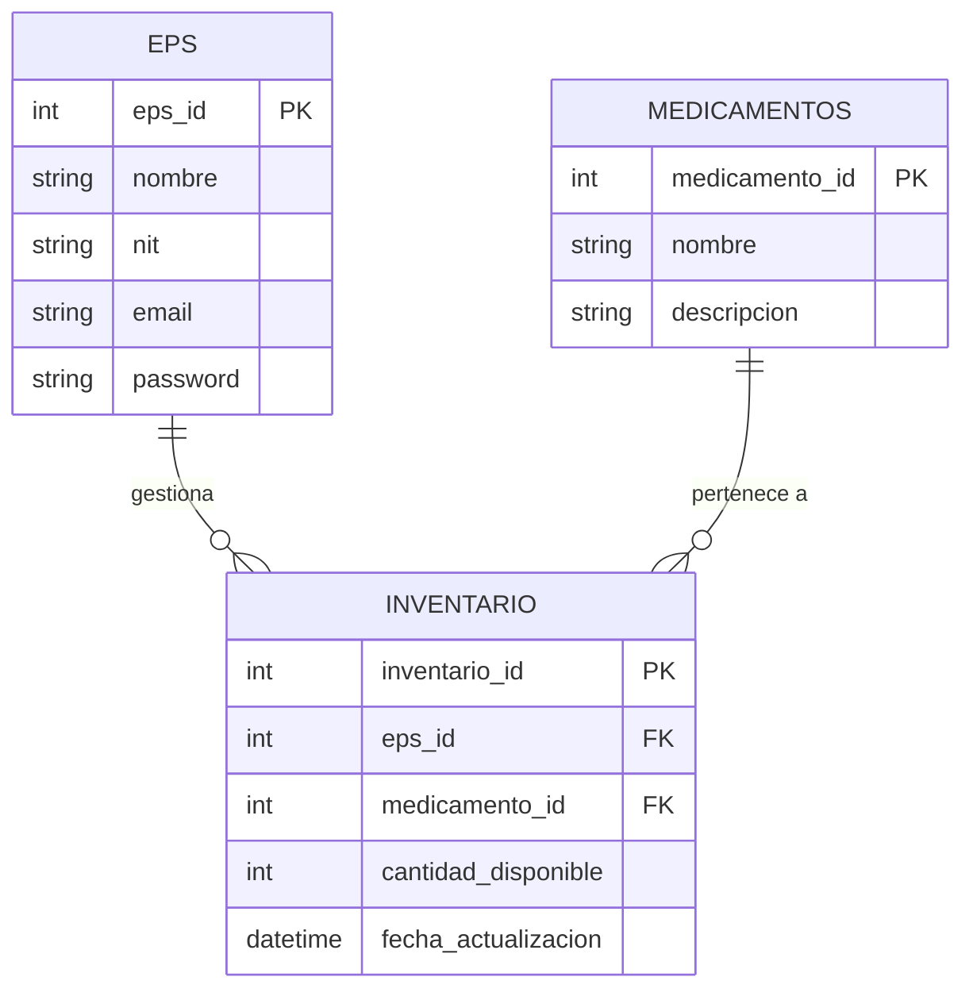

## Diagrama de modelo relacional

```mermaid
erDiagram
    EPS {
        int eps_id PK
        string nombre
        string nit
        string email
        string password
    }

    MEDICAMENTOS {
        int medicamento_id PK
        string nombre
        string descripcion
    }

    INVENTARIO {
        int inventario_id PK
        int eps_id FK
        int medicamento_id FK
        int cantidad_disponible
        datetime fecha_actualizacion
    }

    EPS ||--o{ INVENTARIO : "gestiona"
    MEDICAMENTOS ||--o{ INVENTARIO : "pertenece a"
```
    
## Diagrama Ad Hoc

## Diagrama de casos de uso

## Diagrama de secuencia de todos los casos de uso 

## Diagrama de componentes

